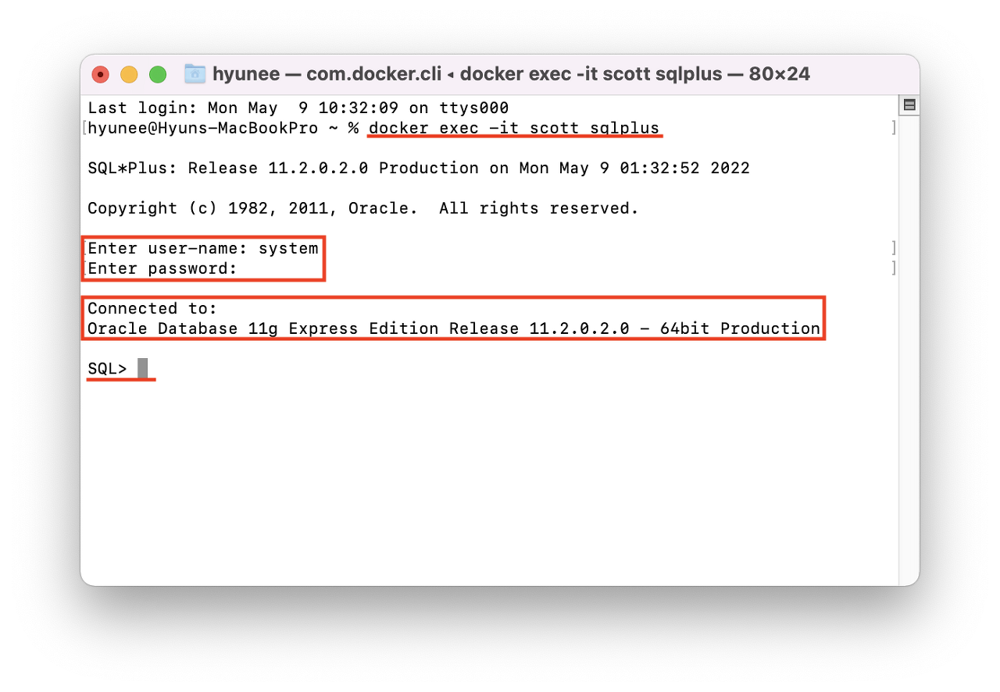

## 1. 서론

과정형평가형 정보처리 산업기사를 준비하면서 공부하게 된 Jsp에 대해서 다뤄보려고 한다.
일단 처음부터 난관이었다. 어쩌다 보니 지금 당장 사용할 수 있는 환경이 macOS밖에 없었기 때문이었다.

내가 알기로는 macOS 자체에 오라클 데이터베이스를 사용할 수가 없는 걸로 알고 있었기에 아 어쩌지 어쩌지 하는 상황이었다.

  
하지만 알아보니 Docker를 통해서 macOS 환경에서 사용할 수 있다는 걸 발견했다!!

  
그저 빛 도커  
그렇게 되서 도커를 통해서 다행히 Jsp를 공부할 수 있게 되었다.

## 2. 그렇다면 🐳 어떻게 설치를?

일단 기본적으로 도커가 깔려있어야 한다. 도커 설치 방법에 대해서는 다음 링크를 참고하자!!
👉 [<a href="">도커를 설치해보자!!</a>]

도커의 설치가 마무리 되었다면 터미널 or iterm(설명하지 않아도 알거라고 생각한다.)을 실행시켜준다.

## 3. 설치가 끝났다면 sqlplus를 실행시켜 보자

오라클 데이터베이스의 설치가 끝나면 다음과 같은 명령어를 입력해주면 된다.  
Enter name에는 `system`을 Enter Password에는 `oracle`을 입력해주면 된다.

## 4. 결론

이번 실습을 통해 도커의 또다른 사용법에 대해서 알 수 있었고
